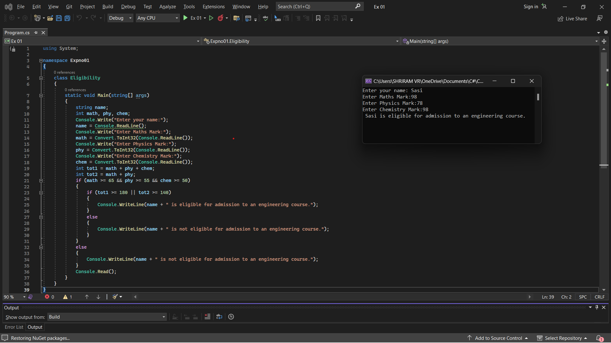

# Eligibility-for-Admission

## Aim:
To write C# program to find the eligibility for admission to an engineering course

## Algorithnm:
### Step1:
Start by creating a new class.

### Step2:
Initiate the integer variables to assign the marks of Maths, Physics and Chemistry and a string variable to assign the name of the student; read the input from the user.

### Step3:
Calculate the first total that sums all the 3 subject marks; and the second total that sums maths and physics marks.

### Step4:
Based on the condition given, check whether the student is eligible for the engineering admission.

### Step5:
Display the output for the input read from the user.

### Step6:
Stop the execution.

## Program:
Program developed by : Shriram R

Register number : 212221240053
~~~
using System;

namespace Expno01
{
    class Eligibility
    {
        static void Main(string[] args)
        {
            string name;
            int math, phy, chem;
            Console.Write("Enter your name:");
            name = Console.ReadLine();
            Console.Write("Enter Maths Mark:");
            math = Convert.ToInt32(Console.ReadLine());
            Console.Write("Enter Physics Mark:");
            phy = Convert.ToInt32(Console.ReadLine());
            Console.Write("Enter Chemistry Mark:");
            chem = Convert.ToInt32(Console.ReadLine());
            int tot1 = math + phy + chem;
            int tot2 = math + phy;
            if (math >= 65 && phy >= 55 && chem >= 50)
            {
                if (tot1 >= 180 || tot2 >= 140)
                {
                    Console.WriteLine(name + " is eligible for admission to an engineering course.");
                }
                else
                {
                    Console.WriteLine(name + " is not eligible for admission to an engineering course.");
                }
            }
            else
            {
                Console.WriteLine(name + " is not eligible for admission to an engineering course.");
            }
            Console.Read();
        }
    }
}
~~~

## Output:

## Result:

Thus, a C# program to check the eligibility of a student on engineering admission has been executed successfully.

